# **Tutorial-1: Run baseline training on Google Cloud using your docker**

The goal of this tutorial is to teach you to run a baseline training
job on Google Cloud using your own docker as a first step. At
this point, we will not discuss the
 Neural-Architecture-Search (NAS) features much. We will use an existing
"mnist-trainer" as an example docker. However, these steps generalize to any
other training-docker as well. After going through this example,
you can later integrate own training-docker in a similar way.

After completing this tutorial, you should be able to:

-   Manage training-data on Google-Cloud-Storage (GCS) location under your
    project.
-   Integrate with the NAS-service.
-   Build a docker.
-   Run a baseline training locally and on Google Cloud.
-   Monitor training progress using UI.
-   Verify output files residing on a GCS location.
-   View and download logs for the training job.
-   Visualize training plots via the Google Cloud Tensorboard.

## Prerequisites

The training job in this tutorial only uses one cloud CPU and runs only
for ~5 mins so you do not need any quota.
But before you run this tutorial, please set up your environment as described
[here](https://cloud.google.com/vertex-ai/docs/training/neural-architecture-search/environment-setup)
except for quota.

---
**NOTE:** This only needs to be done once for your project.

---

## Troubleshooting and support

If you face any issues, first use the
[troubleshooting page](https://cloud.google.com/vertex-ai/docs/general/troubleshooting.md#neural-architecture-search)
to find the answer. If you can not find
a solution there, [request for support](https://cloud.google.com/vertex-ai/docs/support/getting-support#nas-support).

## Manage training-data on Google-Cloud-Storage (GCS) location under your project

When you run a training job on Google Cloud, your input training-data needs
to either reside in the container or
on a GCS location under your project. A GCS file location format is:
`gs://<a-bucket-under-my-project>/<path-to-sub-dir>/<my-file>`.
The `<path-to-sub-dir>` can have multiple nested directories.

---
**NOTE:** For the ["mnist-trainer"](https://github.com/google/vertex-ai-nas/blob/main/third_party/tutorial/mnist_train.py)
here, the training-data is downloaded
internally by the trainer so there is no need to upload the training files.
**You should skip this section if you are using our "mnist-trainer" example
and move onto the section on integrating with the NAS service.**

---

However, if you are using your own docker, you should upload your own
training-data. You should have learned to create a "bucket" under your
project [when setting up your environment](https://cloud.google.com/vertex-ai/docs/training/neural-architecture-search/environment-setup#set-up-cloud-storage).
You can copy any file to your bucket using the `gsutil`
[commands](https://cloud.google.com/storage/docs/quickstart-gsutil).
Here is an example:

```sh
gsutil cp <local-path-to-my-file>/abc.txt gs://<my-bucket>/training_data/
```

The above command will copy file `abc.txt` to a `training_data` folder
under your bucket. You can also use `gsutil ls`, `gsutil rm`, and so on,
similar to the shell commands `cp`, `ls`, and so on.

---
**NOTE:** You created a bucket under your own project. The training-job running
under this project will by default get access to this bucket. However, if you
run a training job under a different project and try to use this bucket,
then you will have to give
read/write permissions to a service-account for this bucket.

---

---
**NOTE:** Ideally your training data bucket should be in the same
region where you run your NAS jobs. If not, then you will incur
extra data-transfer charges and possible extra charges due to
slightly increased training time as well.

---

### Optional: Alternative way to manage GCS files using UI.

We will show an example of how to create the
following GCS location: `gs://nas_tutorial/training_data`

First navigate to the Google Cloud Platform (GCP) homepage for your project:

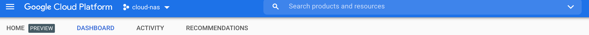

In the search-box, type "storage" and
then click on "Browser" in the drop-down options. This should take you to the
storage-browser for your project:

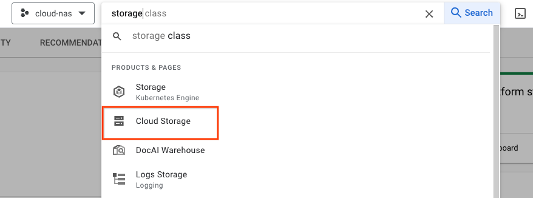

Click on "CREATE BUCKET" and type
`nas_tutorial` as the "bucket-name":

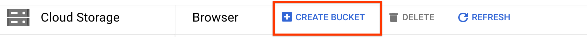

Choose default options for the rest of the
settings and then finish creating the bucket by clicking "CREATE". This should
take you to the bucket-browser:

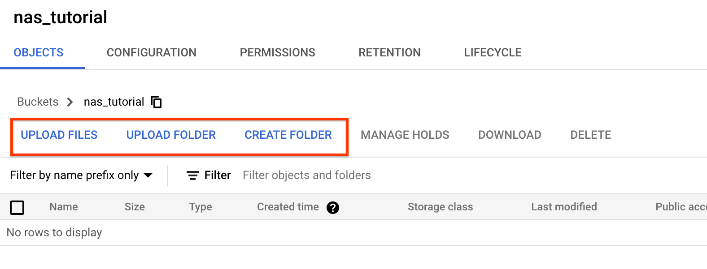

Here, you should click on "CREATE FOLDER" and create a folder named
`training_data`.

## Integrate with the NAS service

We will start with a simple "mnist-trainer" code: [`mnist_train.py`](https://github.com/google/vertex-ai-nas/blob/main/third_party/tutorial/mnist_train.py) and will modify it to
integrate with the NAS-service. The final modified file after this tutorial is
`tutorial1_mnist_search.py`. You can use these changes as an example
when using your own trainer code.

1.  Ingest mandatory flags from the NAS-Service.

    The NAS-service will send some mandatory arguments to your trainer via
    flags. You will add the following flags to your trainer to support this.

    ```py
    # Nas-service related flags.
    parser.add_argument(
        '--nas_params_str', type=str, help='Nas args serialized in JSON string.')
    # NOTE: Although this flag is injected as "job-dir", it is consumed
    # in the code as "argv.job_dir" instead of the hyphen.
    parser.add_argument(
        '--job-dir', type=str, default='tmp', help='Job output directory.')
    parser.add_argument(
        '--retrain_search_job_dir',
        type=str,
        help='The job dir of the NAS search job to retrain.')
    parser.add_argument(
        '--retrain_search_job_trials',
        type=str,
        help='A list of trial IDs of the NAS search job to retrain, '
        'separated by comma.')
    ```
    **For now, we will not go into details of these flags because we just want
    to run a baseline training. We will only use them as placeholders.**
    However, the `job-dir` flag is important for this tutorial because
    it will be used as the output-directory for this training-job.

    ---
    **NOTE:** Although the flag is declared as `job-dir`, it is used eventually as
    `job_dir` in the code. This is as intended. This happens because
    ["argparse" library converts the hyphen to underscore](https://docs.python.org/dev/library/argparse.html#dest).

    ---

    This directory will be a GCS
    location when the job runs on Google Cloud. The Vertex Neural Architecture
    Search service sets the value of this GCS location as an
    environment variable. If this environment variable is set, then
    we will override
    the `job-dir` flag to this variable using the `cloud_nas_utils` library:

    ```py
    argv.job_dir = cloud_nas_utils.get_job_dir_from_environment_if_exist(
      current_job_dir=argv.job_dir)
    ```

    The next step will guide you how to
    modify your trainer-code to use this as the output directory.

1.  Modify file I/O to work with the GCS location.

    [GCS-Fuse](https://cloud.google.com/storage/docs/gcs-fuse)
    mounts GCS buckets to the `/gcs/` directory of each
    cloud training node. So to use GCS in a cloud NAS job, you do
    not need to do any additional work except the following minor change:
    the file paths need to be converted from `gs://<bucket>/` to `/gcs/<bucket>`
    before you start training in your trainer code. You can use our helper
    library function in `gcs_path_utils.py` (show in `tutorial1_mnist_search.py`):
    ```py
    # Convert gs:// path to /gcs/ path.
    argv.job_dir = gcs_path_utils.gcs_fuse_path(argv.job_dir)
    ```

    ---
    **NOTE:** Although straightforward and useful for most use cases,
    this approach has the following limitations:
      - When running the training locally, it is recommended to use your
      local test file. Additional steps are needed if you want to access
      GCS buckets during a local run. Read *Accessing GCS during local run*
      for further instructions.
      - GCS-Fuse is not suited for when reader and writer jobs are accessing
      the same file at the same time. For most training jobs, that does not happen.
      If you encounter this scenario, see *Alternatives to GCS-Fuse*.

    ---

    Then create the job-dir by adding the following lines:

    ```py
    # Create job-dir if it does not exist.
    if not os.path.exists(argv.job_dir):
      os.makedirs(argv.job_dir)
    ```

    ---
    **NOTE:** Although the flag is declared as `job-dir`, it is used above as
    `job_dir` in the code. This is as intended. This happens because
    ["argparse" library converts the hyphen to underscore](https://docs.python.org/dev/library/argparse.html#dest).

    ---

    The "mnist-trainer" example does not read training data from GCS or
    write output files to GCS. So we will write a *dummy* output file at the
    end of the training to the job-directory as an example.

    ```py
    # Since this trainer does not write output files, we will save out
    # dummy files here to illustrate GCS file I/O.
    with open(os.path.join(argv.job_dir, 'dummy_output.txt'),
                           'w') as fp:
      fp.write('Finished training.')
    ```

    When using your own trainer code, you can use this example
    to modify your file I/O code to work with GCS.

1.  Report a reward back to the NAS-service.

    The NAS-service expects a reward (such as accuracy) after the training.
    At the end of the training, you can use the following example to report
    a reward back via `metrics_reporter` class.

    ```py
    import metrics_reporter


    # Reporting metrics back to the NAS_service.
    metric_tag = os.environ.get('CLOUD_ML_HP_METRIC_TAG', '')
    if metric_tag:
      nas_metrics_reporter = metrics_reporter.NasMetricsReporter()
      nas_metrics_reporter.report_metrics(
          hyperparameter_metric_tag=metric_tag,
          metric_value=test_acc,
          global_step=argv.num_epochs,
          other_metrics={})
    ```

    For the above example, `test_acc` is the evaluation accuracy and the
    `argv.num_epochs` is the number of epochs. This is mainly a placeholder for
    now since we are not running a full search yet.

1.  Create a docker file for the trainer-code.

    This tutorial assumes that you are familiar with using
    [Docker](https://docs.docker.com/engine/install/ubuntu/). A docker-image
    packages all the code and dependencies required to run your trainer-code
    remotely on Google Cloud.

    We will use
    `tutorial1.Dockerfile` for the "mnist-trainer" here but you can use/create
    your own Dockerfile for your trainer-code. Note that the `ENTRYPOINT` in the
    `tutorial1.Dockerfile` is `tutorial1_mnist_search.py`.


## Build the docker

Next, you will build the docker image using the Dockerfile that was created.
The following shows how to use nas-client (`vertex_nas_cli.py`) to easily build
and push the docker image:

```sh
PROJECT=<Set your project-id>
REGION=<Set region for artifact registry>

# Set a unique docker-id below. A docker image will be overwritten by another
# with the same docker-id when built in local and pushed to remote repository.
# So it's best to add user-name and date to docker-id to avoid accidentally
# overwriting a local or remote docker image.
DATE="$(date '+%Y%m%d_%H%M%S')"
TUTORIAL_DOCKER_ID=${USER}_tutorial1_${DATE}

# NOTE: 'trainer_docker_file' flag is passed the relative path
# to the dockerfile.
python3 vertex_nas_cli.py build --project_id=${PROJECT} \
  --trainer_docker_id=${TUTORIAL_DOCKER_ID} \
  --trainer_docker_file=tutorial/tutorial1.Dockerfile \
  --region=${REGION}
```

---
**NOTE:** You need to re-build the docker-image everytime you change the code.

---

## Run a baseline training locally

Before you run training on the Google Cloud, do a local test run on your machine.
Local testing allows you to debug common issues quickly before launching jobs
on Google Cloud (which would take a few minutes to start).
To reduce debugging time, use local testing to find issues with your data
format or your custom code changes.

### Run training with docker

You can easily run local training with the docker using the nas-client
(`vertex_nas_cli.py`).

The nas-client expects a search-space to launch
the training, so for now you can pass ANY search-space as a placeholder via the
flag `search_space_module` as shown below. We will discuss this more in later
tutorials.

```sh
# You can use any local job-directory.
DATA_DIR=${PWD}/tutorial
JOB_DIR=/tmp/nas_tutorial
rm -r -f ${JOB_DIR} && mkdir ${JOB_DIR}

python3 vertex_nas_cli.py search_in_local --project_id=${PROJECT} \
--trainer_docker_id=${TUTORIAL_DOCKER_ID} \
--region=${REGION} \
--search_space_module=search_spaces.mnasnet_search_space \
--local_data_dir=${DATA_DIR} \
--local_output_dir=${JOB_DIR} \
--search_docker_flags \
dummy_input_file=dummy_input.txt \
dummy_gcs_bucket=gs://cloud-ml-nas-public \
num_epochs=2
```

---
**NOTE:** When using nas-client, the original flags to the docker
can be passed via the `--search_docker_flags`. The `--search_docker_flags`
takes a list of `<flag1>=<val1>` pairs as an input. Here, the
`num_epochs` flag is
not related to the NAS-service and is part of
the original trainer code. These docker-flags should be passed in
explicitly by the user. However, the NAS-service related flags
that you added earlier, such as `nas_params_str`, will be set
automatically by the NAS-service. The user will not pass in those.

---

Nas-client uses the `--local_data_dir` flag to mount the local data directory
to `/test_data` of the docker container. This tutorial example does not use
local data though, it just reads the `dummy_input_file` and prints a sentence:
```
Hello world.
```

After the local training runs, please verify that you can
see the output files in the `JOB_DIR`. For "mnist-trainer", you
should see `dummy_output.txt` file in the output directory.

### Run training with local binary

Another alternative way to run this tutorial locally is asking
`vertex_nas_cli.py` to run the script `tutorial1_mnist_search.py` directly
without building the docker container.

But this way needs you to install required libraries manually. You can enable
a python virtual environment for the local run:

```shell
python3 -m venv --system-site-packages nas_venv
source nas_venv/bin/activate
pip install tensorflow==2.8.0
```

Then run following commands to launch a local test:

```shell
cp tutorial/tutorial1_mnist_search.py .

python3 vertex_nas_cli.py search_in_local \
--search_space_module=search_spaces.mnasnet_search_space \
--run_local_binary=true \
--local_binary=tutorial1_mnist_search.py \
--local_output_dir=${JOB_DIR} \
--local_binary_flags \
num_epochs=2
```

## Run a baseline training on Google Cloud

Now that you have tested the docker run locally, you can launch your job on
Google Cloud. But before you do that, you should create an output GCS bucket
under your project. You should have learnt to create a "bucket" under your
project [when setting up your environment](https://cloud.google.com/vertex-ai/docs/training/neural-architecture-search/environment-setup#set-up-cloud-storage).

Use a bucket-location under your project as the `GCS_ROOT_DIR` below:

```sh

# Choose a bucket for the output directory.
GCS_ROOT_DIR=<gs://output-bucket>
# Set the region to be same as for your bucket. For example, `us-central1`.
REGION=<set the same region as the bucket>

# Setting a unique job-id so that subsequent job-runs
# do not have naming conflict.
DATE="$(date '+%Y%m%d_%H%M%S')"
JOB_NAME="tutorial1_${DATE}"

python3 vertex_nas_cli.py search \
--project_id=${PROJECT} \
--region=${REGION} \
--job_name="${JOB_NAME}" \
--trainer_docker_id=${TUTORIAL_DOCKER_ID} \
--search_space_module=search_spaces.mnasnet_search_space \
--accelerator_type="" \
--nas_target_reward_metric="top_1_accuracy" \
--root_output_dir=${GCS_ROOT_DIR} \
--max_nas_trial=1 \
--max_parallel_nas_trial=1 \
--max_failed_nas_trial=1 \
--search_docker_flags \
num_epochs=2
```

The flag `job_name` sets a name for your job. You have already learnt
about the
`trainer_docker_id`, `search_space_module`, and the docker specific
`num_epochs` flags during the local run. Let
us discuss a bit about the other flags that are used here. The `region`
flag is only needed for the Google Cloud job and it should be the same
as your GCS bucket region. The
`accelerator_type` sets the accelerator-device on Google Cloud to be used
during training. The empty-string selects a CPU device. But for your
docker you can also select a GPU of your choice.
The `nas_target_reward_metric` flag sets the name of the reward sent back to
the NAS-service by the trainer-code. Remember that you used the
`metrics_reporter` class earlier when modifying your trainer-code. The code
contained the line:

```py
metric_tag = os.environ.get('CLOUD_ML_HP_METRIC_TAG', '')
```

The `nas_target_reward_metric` flag that you set here, will be then used
to set the value for the `metric_tag`. This is just a name and will
not affect the functionality in anyway. You are free to choose any
reward-name. The `root_output_dir` sets the output bucket for this
training-job. The actual directory that will be used for output
of your training will be `<root_output_dir>/<dir_name>/nas/search/1` where
`dir_name` is a combination of `job_name` and a time-stamp and `1`
corresponds to the trial-id for your job. You can reuse the bucket
`root_output_dir` for multiple jobs.

---
**NOTE:** The nas-client can spawn many copies of the docker in
parallel using multiple machines. Each trial-instance gets a number 1, 2, ...
as a trial-id. We will discuss this in more detail in a later tutorial.
For this tutorial, you will only spawn one instance of your training-job
by setting `max_nas_trial`, `max_parallel_nas_trial`, and
`max_failed_nas_trial` as 1 for now.

---

## Monitor training progress using UI

When you launch the Google Cloud job using the nas-client,
it should print out the job link as:

```sh
View NAS Search job in the Google Cloud Console at: <cloud job link>
```

The link should take you to the job UI page which looks something like this:

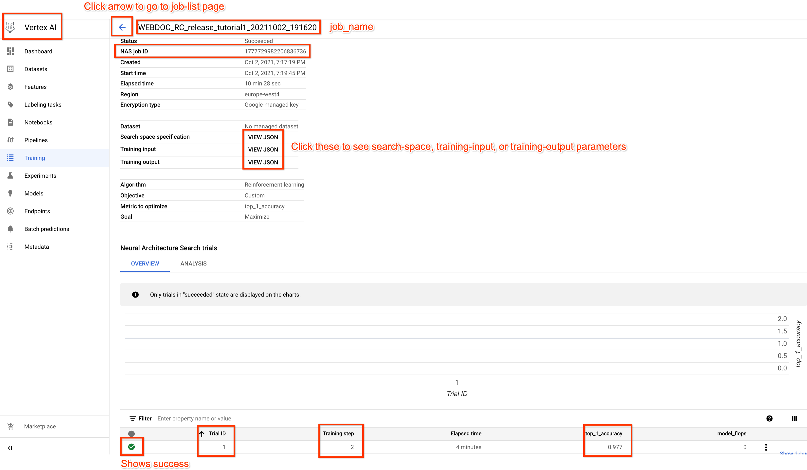

On top, you can see your "job-name". The "job-id" is separate
from the "job-name". At the very bottom,
you can see that you ran one trial successfully. The
`top_1_accuracy` reward and `Training step` show the values
returned by the trainer via the `metrics_reporter` class.

If you click on the arrow icon on top-left, then it will show you a
list of all the jobs that you have launched on cloud for your project
*in the same region as your current job*.

By clicking the `VIEW JSON` icon next to the `Training input`
in the middle of the page, you can take a look at all the flags
that were set for this job:

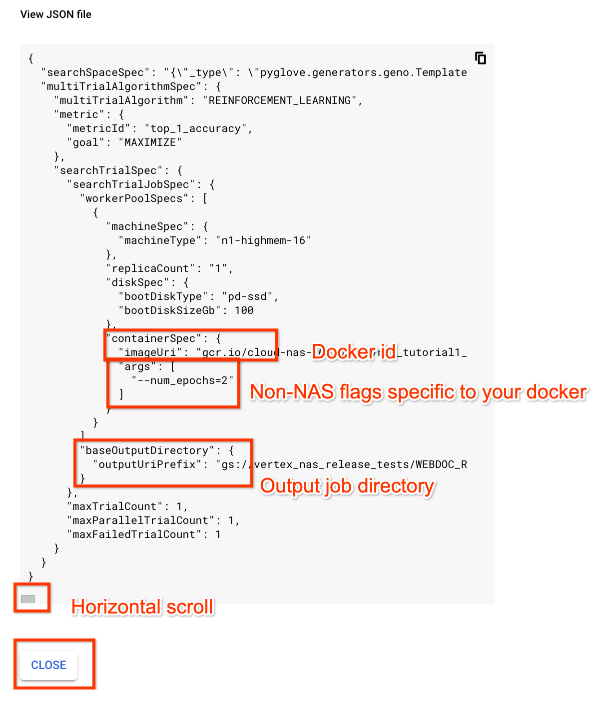

This is useful, if you visit a previous job after a while and want to
check the parameters that were set or find out the output job directory.

## Verify output files residing on a GCS location

Please verify that you can
see the output files in the `<job_dir>/nas/search/1`
for your Google Cloud job where '1'
is the trial-id. For "mnist-trainer", you
should see `dummy_output.txt` file in the output directory. An easy way to
inspect the GCS location is to use the `gsutil`
[commands](https://cloud.google.com/storage/docs/quickstart-gsutil):

```sh
jobDir=<job-dir>
gsutil ls ${jobDir}/nas/search/1
```
---
**NOTE:** The `dummy_output.txt` file may be inside a sub-folder
of the trial-dir '1'.

---

## Download trial metrics

You can download trial metrics as a JSON file to local disk using the command:

```sh
python3 vertex_nas_cli.py list_trials \
--project_id=${PROJECT_ID} \
--region=${REGION} \
--job_id=<numeric-job-id> \
--trials_output_file=<path-to-output-file>
```

The saved JSON file should be like:
```
[
    {
        "name": "...",
        "parameters": "...",
        "searchTrial": {
            "id": "1",
            "state": "SUCCEEDED",
            "finalMeasurement": {
                "stepCount": "16634",
                "metrics": [
                    {
                        "metricId": "AP",
                        "value": 0.10061053931713104
                    },
                    {
                        "metricId": "model_flops",
                        "value": 8.852448902
                    }
                ]
            },
            "startTime": "2023-01-08T07:42:18.987767081Z",
            "endTime": "2023-01-08T10:11:18Z"
        }
    }
]
```

---
**NOTE:** Only `SUCCEEDED` trials can be listed in the JSON file.

---

## View logs for the training job

To view the logs for trial-1, click the triple-dot icon at the end of
the trial-id row and then open `View logs` in new tab:

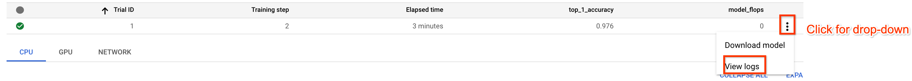

---
**NOTE:** We use `cloud_nas_utils.setup_logging()` call to
(a) set logging level to INFO and (b) remove duplicate logging
caused by the tensorflow logger.

---

### Do not use logs as the only way to store important information

Although using logs is a convenient way to debug job and record information,
treating it as the only way to store important information is not recommended.
Because according to the [Cloud log retention policy](https://cloud.google.com/logging/quotas#logs_retention_periods),
logs held in the [_Default](https://cloud.google.com/logging/docs/routing/overview#default-bucket)
bucket, like daily training job logs, are retained for 30 days unless custom
configured.

So you are highly recommended to save important job information separately to a
permanent storage like a GCS bucket.

### Download logs for the purpose of sharing for debugging

Sometimes you may need to share the logs with the NAS team for support.
One option is to capture a snapshot of the area of interest. Another option
is to download the logs and then email them.

To download the logs, click the `Actions` icon,
then click `Download logs`, and then choose "JSON" format to save the file:

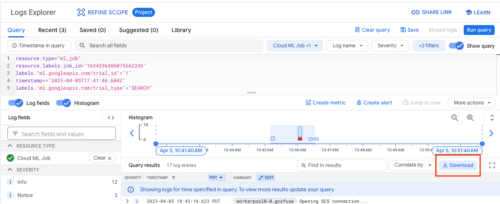


## Visualize training plots via the Google Cloud Tensorboard

To visualize training plots via tensorboard, you can use Google Cloud shell
to launch the tensorboard. You can click the "command-prompt" icon to open
the Google Cloud shell as shown below:

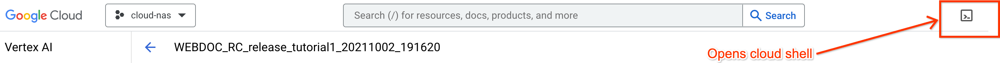

The Google Cloud shell should open at the bottom half of the screen. At the
command prompt, use the following command to launch the tensorboard:

```sh
tensorboard --logdir=<gs://path-to-your-job-directory> --port=8080 --load_fast=false
```
---
**NOTE:** If running the command results in a TypeError related to protobuf package, you may need to run the following command as a temporary workaround in the Google Cloud Shell before launching tensorboard.
```sh
pip install protobuf==3.20.*
```

---

Once the command runs (You may have to click `Authorize` if prompted),
click on the web-preview icon and then click on
the `Preview on port 8080` to see the tensorboard plots:

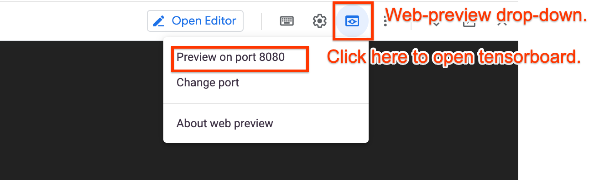

---
**NOTE:** If you did not specify a port or used a different port number,
then you will have to click on `Change port` to use the correct port number.

---

For the mnist-trainer example here, you should see a plot similar to this:

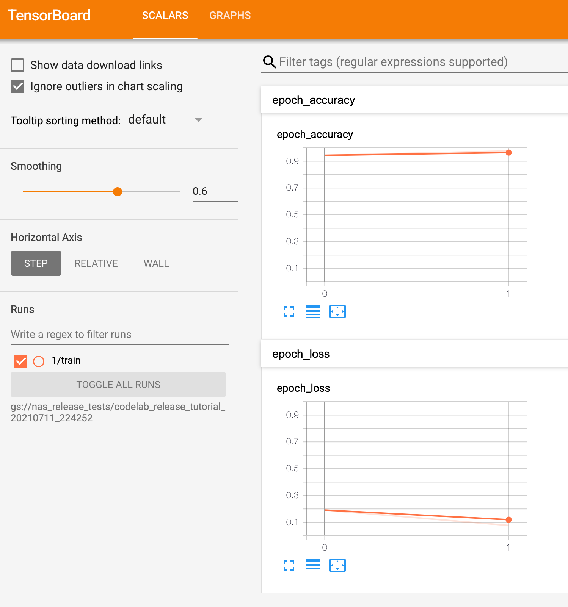

## Cancel NAS job

If you want to cancel a NAS job, first go to the job-list UI page by
clicking `Training`:

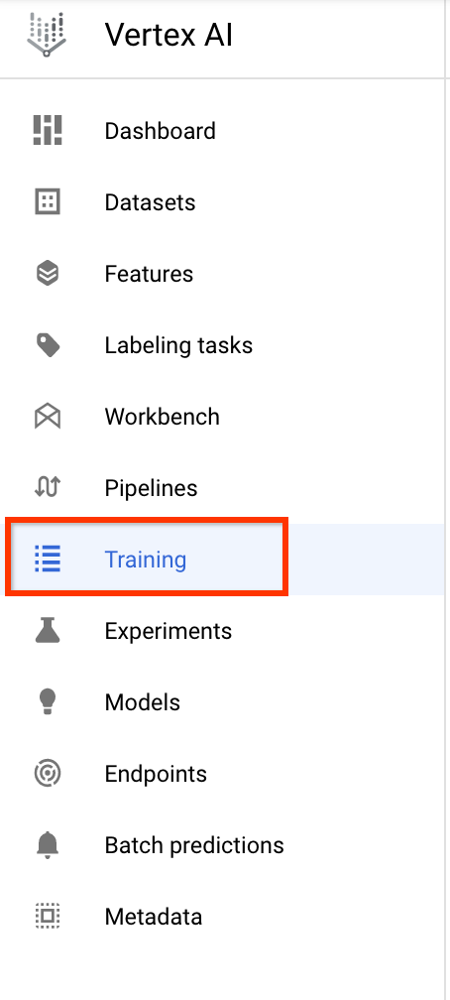

Then you can find a cancel button for each job by clicking the kebab menu
(three dots button) of the job:

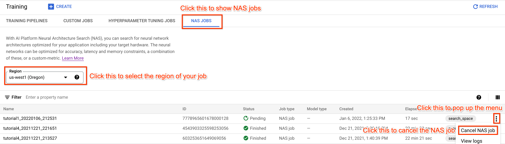

## [Advanced] Accessing GCS during local run

If you want to access GCS buckets during local runs, you must modify your
trainer code I/O. You may use any of the options in *Alternatives to GCS-Fuse*.
You may also [mount](https://github.com/GoogleCloudPlatform/gcsfuse/blob/master/docs/mounting.md)
your GCS bucket to the `/gcs` directory, although we do not recommend this approach.

The local docker container requires the credentials of
your account to get authenticated. After you finish
[the setup of your local environment](https://cloud.google.com/vertex-ai/docs/training/neural-architecture-search/environment-setup#local-environment-setup),
`gcloud` generates credentials of your account under the `~/.config/gcloud` folder.
When you run NAS jobs locally with docker, nas-client will mount the `~/.config/gcloud`
folder into the docker for you to acquire the necessary credential to access GCS buckets.
Please see the `run_container_local` function in
[vertex_nas_cli.py](https://github.com/google/vertex-ai-nas/blob/main/vertex_nas_cli.py)
for the implementation.

## [Advanced] Alternatives to GCS-Fuse

If you do not want to use GCS-Fuse, you must modify your trainer code to work
with the GCS location using one of the following options:

1. If your docker uses Tensorflow already, then use the `tf.io.gfile`
  library to interact with GCS. You can find example usage in
  `gcs_utils_using_tf_gfile.py` in `gcs_utils`.

1. If your docker does not use Tensorflow already, then you need not
  install the entire Tensorflow. Just use the lightweight Google Cloud
  Storage client via our `gcs_utils_using_cloud_storage.py` helper file.
