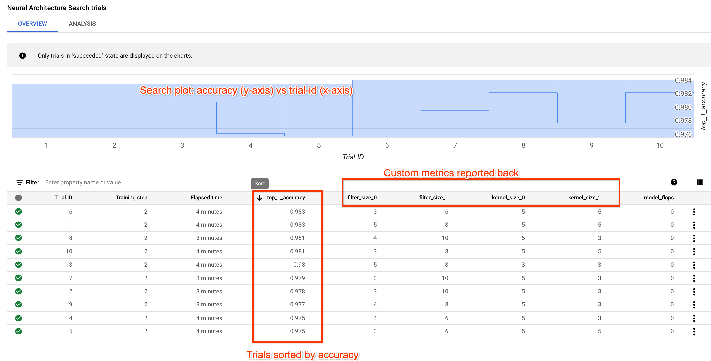
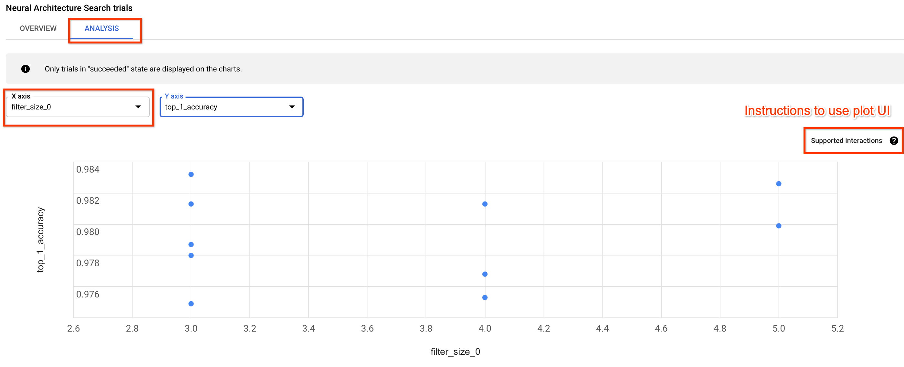
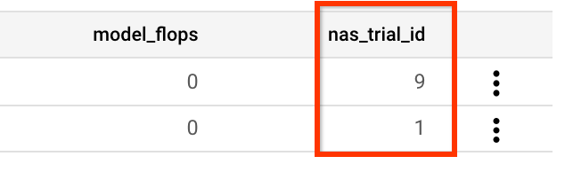

# **Tutorial-3: Run an architecture search on Google Cloud**

By now you have learnt to launch one instance of your training-docker
on Google Cloud and also to create search-spaces. However, a
full architecture-search involves:
1. the NAS-service launching multiple copies of your training-docker (trials),
1. where each trial receives a different architecture
   suggestion from the NAS-service,
1. each trial uses the architecture suggestion to build a model and
1. reports a reward  for this architecture back to the NAS-service,
1. and the NAS-service then spawns new trials with better and better
   architecture suggestions.

In this tutorial you will launch a full search using the existing
"mnist-trainer". After completing this tutorial, you should be able to:

-  Build a model from the sampled architecture suggestion for a trial.
-  Report custom metrics back to the NAS-service.
-  Understand the concept of the number of total, parallel, and failed trials.
-  Launch a stage1 search on Google Cloud.
-  Navigate a search-job UI page.
-  Launch a stage2 train-only job for a previous search.

All the code for this tutorial can be found in `tutorial3_mnist_search.py`
file. Further reading on stage1 search and stage2 train jobs can be in the [*Best
practices and workflow* guide](https://cloud.google.com/vertex-ai/docs/training/neural-architecture-search/suggested-workflow#two_stages).

## Prerequisites

The training job in this tutorial only uses 2 cloud CPUs and runs
~10 trials each running for ~4 mins. The total runtime is ~20 mins.
You do not need any extra quota.

## Build a model from the sampled architecture suggestion for a trial

For this tutorial, we will reuse the
`mnist_list_of_dictionary_search_space` from the tutorial
on search-spaces. As you have seen before,
the NAS-service will sample this search-space to
send an architecture-suggestion via the `nas_params_str` and the
training-code will use it to build the model-spec like this:

```py
# Process nas_params_str passed by the NAS-service.
# This gives one instance of the search-space to be used for this trial.
tunable_object = cloud_nas_utils.parse_and_save_nas_params_str(
    search_space=search_spaces.mnist_list_of_dictionary_search_space(),
    nas_params_str=argv.nas_params_str,
    model_dir=argv.job_dir)
unused_serialized_tunable_object = cloud_nas_utils.serialize_and_save_tunable_object(
    tunable_object=tunable_object, model_dir=argv.job_dir)
model_spec = tunable_object
```

You can now use the `model_spec` to build the model as shown below:

```py
def create_model(model_spec):
  """Create a model for training.

  Args:
    model_spec: A PyGlove-based search-space-sample.

  Returns:
    The model to use for training.
  """
  layers = [tf.keras.layers.Lambda(lambda x: tf.reshape(x, (-1, 28, 28, 1)))
           ] + [
               tf.keras.layers.Conv2D(
                   filters=layer_spec.filter_size,
                   kernel_size=(layer_spec.kernel_size, layer_spec.kernel_size),
                   padding='same',
                   activation='relu') for layer_spec in model_spec
           ]

  layers.append(tf.keras.layers.Flatten())
  layers.append(tf.keras.layers.Dense(10, activation='softmax'))
  return tf.keras.Sequential(layers)
```

The function uses
the model_spec to build two layers with the required
kernel and filter-sizes.

## Report custom metrics back to the NAS-service

In Tutorial-1, we reported minimum required metrics such as the
`metric_value` (test-accuracy) and the `global_step` (number-of-epochs)
back to the NAS-service. Here you will learn to report additional metrics
back to the NAS-service. These additional metrics will not just appear
in the job-UI page but can also be analyzed offline later.

For this example we will report additional metrics
`other_metrics` as the kernel
and filter-sizes for the model. However, you can use any metric of your
choice using the following code as an example:

```py
# Reporting the model metadata.
other_metrics = {
    'filter_size_0': model_spec[0].filter_size,
    'kernel_size_0': model_spec[0].kernel_size,
    'filter_size_1': model_spec[1].filter_size,
    'kernel_size_1': model_spec[1].kernel_size
}

# Reporting metrics back to the NAS_service.
metric_tag = os.environ.get('CLOUD_ML_HP_METRIC_TAG', '')
if metric_tag:
  nas_metrics_reporter = metrics_reporter.NasMetricsReporter()
  nas_metrics_reporter.report_metrics(
      hyperparameter_metric_tag=metric_tag,
      metric_value=test_acc,
      global_step=argv.num_epochs,
      other_metrics=other_metrics)
```

## Understand the concept of the number of total, parallel, and failed trials

You are now ready to launch a stage1 search-job
on Google Cloud. But before you launch
a large scale job, let us first understand
a bit about the `max_nas_trial`, `max_parallel_nas_trial`, and
`max_failed_nas_trial` flags which control the orchestration of the
trials on Google Cloud and also the way in which compute resources are used.

Let us look at the command to launch a small test search job on Google Cloud:
```sh
PROJECT=<Set your project-id>

# Set a unique docker-id below. It is a good practice to add your user-name
# to prevent overwriting another user's docker image.
DATE="$(date '+%Y%m%d_%H%M%S')"
TUTORIAL_DOCKER_ID=${USER}_tutorial3_${DATE}

GCS_ROOT_DIR=<gs://output-bucket>
REGION=<same as bucket region>

# Setting a unique job-id so that subsequent job-runs
# do not have naming conflict.
JOB_NAME="tutorial3_${DATE}"

# Build Tutorial Trainer
python3 vertex_nas_cli.py build --project_id=${PROJECT} \
--trainer_docker_id=${TUTORIAL_DOCKER_ID} \
--trainer_docker_file=tutorial/tutorial3.Dockerfile \
--region=${REGION}

python3 vertex_nas_cli.py search \
--project_id=${PROJECT} \
--region=${REGION} \
--job_name="${JOB_NAME}" \
--trainer_docker_id=${TUTORIAL_DOCKER_ID} \
--search_space_module=tutorial.search_spaces.mnist_list_of_dictionary_search_space \
--accelerator_type="" \
--nas_target_reward_metric="top_1_accuracy" \
--root_output_dir=${GCS_ROOT_DIR} \
--max_nas_trial=10 \
--max_parallel_nas_trial=2 \
--max_failed_nas_trial=3 \
--search_docker_flags \
num_epochs=2

```

The `max_nas_trial` decides the *total* number of trials
(search-space-samples) that will be run. For example, if you set it
to 2000, then it means that you will sample
your search space 2000 times at max. However, this does *not* mean
that all these 2000 trials will be run at the same time.
That is a huge demand on compute resources!
Each trial may require a CPU or (multiple) GPU. This
accelerator requirement is set by the `accelerator_type` flag.
In the above example, it is set to use CPUs
(empty-string defaults to CPU). *Each customer project is
allocated a **quota** (pool) of accelerators to use.* For example,
let us say that your project is given a
maximum of 50 GPUs to use at one time and each of your trial uses
one GPU. This means that you can not run more than 50 parallel trials
at a time.

The `max_parallel_nas_trial` controls how many trials are run
in parallel at one time. For example, if you set it to 50, and your
`max_nas_trial` is set to 2000, then your job will launch
a *batch* of only 50 trials first. As soon as a trial finishes
and a resource gets available, an another trial will be launched.
Please note that the different trials may run different sized
models so may take different time to finish. As
the trials in the first batch finish one-by-one, they get replaced
by new trials in a continuous manner. However, at a given time,
only 50 trials will run. So to
finish 2000 trials, it will take 40 *batches* of trials. This
ensures that your resource utilization does not explode. This also
controls the total run-time for your job. For example,
if each trial takes 1 hour to finish, then
each *batch* of trials (running in parallel) will take 1 hour to finish,
and 40 batches will take 40 hours to finish.

---
**NOTE:** The quota of accelerators on Google Cloud is typically given
in a *region* (a geographic location). For example, you may be allocated
50 V100 GPUs in `us-central1` region.

---

The `max_failed_nas_trial` flag keeps a cap on the maximum trial failures.
A trial can fail for reasons such as (a) out-of-memory exception for
a large model in the search space, (b) NAN error due to
gradient explosion if learning rate is high, (c) unforseen training
exception, and so on. When one trial fails, the NAS-service does not stop the
search-job. It assumes that this model for the failed-trial is not
a good choice. It then accordingly samples other areas in the search-space
and keeps on doing this until the total number of trials are done.
However, if the percentage of trial failures is very large, then
it indicates some major problem in the training or search-space setup.
It is better for the search-job to stop if a lot of trial-failures are seen
instead of wasting resources on a meaningless search at this point.
Setting the `max_failed_nas_trial` flag to 1/3 (or 1/4) the
value of `max_nas_trial` is a good practice.

## Navigate a search-job UI page

Please launch a small test search job and verify that a
total of 10 trials will be run but only 2 at a time:

```sh
PROJECT=<Set your project-id>

# Set a unique docker-id below. It is a good practice to add your user-name
# to prevent overwriting another user's docker image.
DATE="$(date '+%Y%m%d_%H%M%S')"
TUTORIAL_DOCKER_ID=${USER}_tutorial3_${DATE}

GCS_ROOT_DIR=<gs://output-bucket>
REGION=<same as bucket region>

# Setting a unique job-id so that subsequent job-runs
# do not have naming conflict.
JOB_NAME="tutorial3_${DATE}"

# Build Tutorial Trainer
python3 vertex_nas_cli.py build --project_id=${PROJECT} \
--trainer_docker_id=${TUTORIAL_DOCKER_ID} \
--trainer_docker_file=tutorial/tutorial3.Dockerfile \
--region=${REGION}

python3 vertex_nas_cli.py search \
--project_id=${PROJECT} \
--region=${REGION} \
--job_name="${JOB_NAME}" \
--trainer_docker_id=${TUTORIAL_DOCKER_ID} \
--search_space_module=tutorial.search_spaces.mnist_list_of_dictionary_search_space \
--accelerator_type="" \
--nas_target_reward_metric="top_1_accuracy" \
--root_output_dir=${GCS_ROOT_DIR} \
--max_nas_trial=10 \
--max_parallel_nas_trial=2 \
--max_failed_nas_trial=3 \
--search_docker_flags \
num_epochs=2 \
--train_docker_flags \
num_epochs=2 \
--train_accelerator_type="" \
--train_max_parallel_trial=1 \
--train_frequency=10
```

Click the job-link output after the command-run to go to the job-UI page:
Please note that only 2 trials run at a given time. After all the 10 trials finish,
you should see something like this:



Each trial uses a different
model as shown by the values for the custom-metrics. Therefore,
the different trials will show different accuracies. The search-plot
at the top is very important because it shows how the reward
changes as the trials progress.
In the figure, the trials are sorted by "top_1_accuracy" column but you can sort
the table by any column by clicking on the top of that column.

You can also click on `ANALYSIS` tab:



This tab gives you option to change fields for the x and y axis to
do further analysis. Each "dot" represents one trial/model.

## Launch a stage2 train-only job for a previous search

Typically, the search-jobs are only a small representation of the
full training job, which we call a [*proxy-task*](https://cloud.google.com/vertex-ai/docs/training/neural-architecture-search/proxy-task-design).
Therefore, you should do a full training of a few
*top* search-trials seen so far.

To enable a stage2 train only job, you should add the following code which
loads the `nas_params_str.json` stored in GCS from the previous search trials:

```py
if argv.retrain_search_job_trials:
  # Resets `nas_params_str` if this job is to retrain a previous NAS trial.
  argv.nas_params_str = cloud_nas_utils.get_finetune_nas_params_str(
      retrain_search_job_trials=argv.retrain_search_job_trials,
      retrain_search_job_dir=argv.retrain_search_job_dir)
```

The code above uses the `retrain_search_job_dir` flag as
the search job directory
and then loads the `nas_params_str.json` files for the trials
selected by the `retrain_search_job_trials` flag. *These two flags will
be sent by the Vertex Neural Architecture Search service to your
trainer docker automatically.*

You should also add the following code when reporting metrics:

```py
if argv.retrain_search_job_trials:
    other_metrics['nas_trial_id'] = cloud_nas_utils.get_search_trial_id_to_finetune(
            argv.retrain_search_job_trials)
```

The above code will display the previous search job trial ids in the UI
as a column entry.

You can now launch the train only job via:

```sh
PROJECT=<Set your project-id>

# Set a unique docker-id below. It is a good practice to add your user-name
# to prevent overwriting another user's docker image.
DATE="$(date '+%Y%m%d_%H%M%S')"
TUTORIAL_DOCKER_ID=${USER}_tutorial3_${DATE}

GCS_ROOT_DIR=<gs://output-bucket>
REGION=<same as bucket region>

# Set your previous search-job-id for the search job that you launched
# previously in this tutorial.
# NOTE: This is a numeric value and not the job-name.
SEARCH_JOB_ID=<numeric value>
SEARCH_JOB_REGION=<region for the previous search job>
# Setting a unique train job suffix by adding date-time.
TRAIN_JOB_SUFFIX="retrain_test_${DATE}"
# For this example, we select trials 1 and 9 to retrain.
TRAIN_NAS_TRIAL_NUMBERS="1,9"

# Build Tutorial Trainer
python3 vertex_nas_cli.py build --project_id=${PROJECT} \
--trainer_docker_id=${TUTORIAL_DOCKER_ID} \
--trainer_docker_file=tutorial/tutorial3.Dockerfile \
--region=${REGION}

python3 vertex_nas_cli.py train \
--project_id=${PROJECT} \
--region=${REGION} \
--search_job_id=${SEARCH_JOB_ID} \
--search_job_region=${SEARCH_JOB_REGION} \
--train_job_suffix=${TRAIN_JOB_SUFFIX} \
--train_nas_trial_numbers=${TRAIN_NAS_TRIAL_NUMBERS} \
--trainer_docker_id=${TUTORIAL_DOCKER_ID} \
--search_space_module=tutorial.search_spaces.mnist_list_of_dictionary_search_space \
--train_accelerator_type="" \
--nas_target_reward_metric="nas_reward" \
--root_output_dir=${GCS_ROOT_DIR} \
--train_docker_flags \
num_epochs=2
```

Once the job finishes, the UI page should show the search trial ids
1 and 9 like this:



## Before you run a full NAS search job

This tutorial showed you how to run a 'toy' NAS job example.
However, a real NAS job involves running at least 2000 trials where
each trial runs a **proxy task** which is a tailored smaller
version (~1-2 hours training time) of the full-training job.

Read the [**Best practices and suggested workflow**](https://cloud.google.com/vertex-ai/docs/training/neural-architecture-search/suggested-workflow)
guide to learn the end to end NAS job workflow and
the [**Proxy task design**](https://cloud.google.com/vertex-ai/docs/training/neural-architecture-search/proxy-task-design)
guide before you run an actual NAS job.

