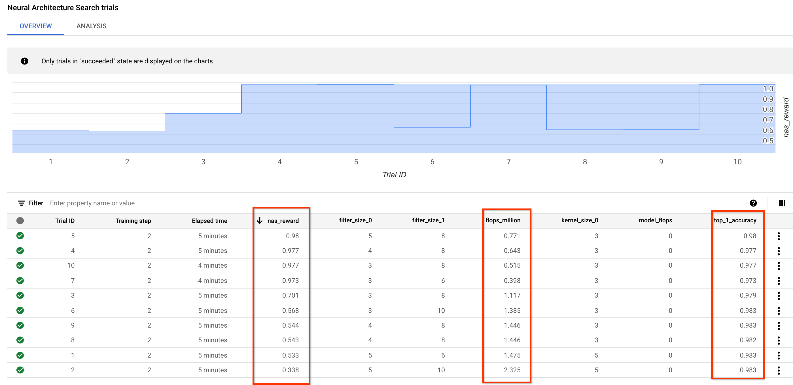
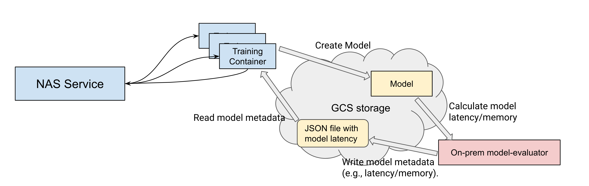
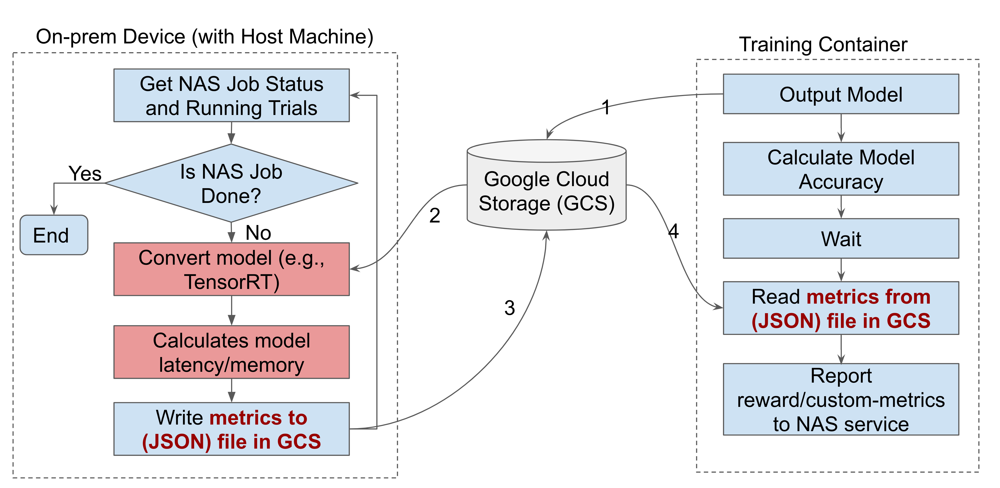
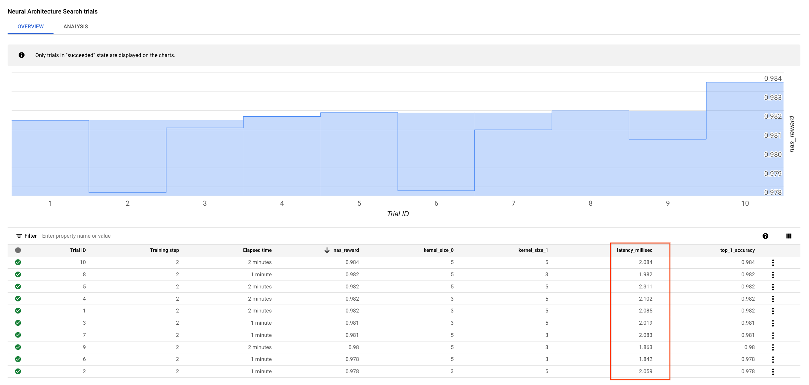
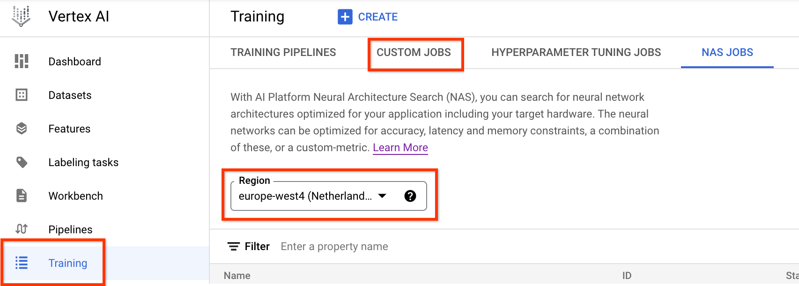
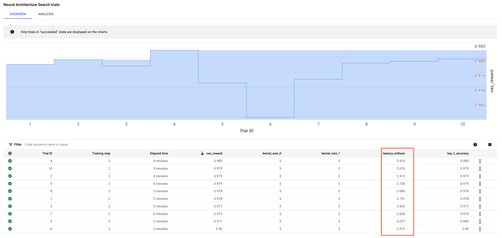

# Tutorial 4: Add latency constraint to search: FLOPS or device-based

Many a time, larger models may give better accuracies
but may not be practical to use due to latency or memory or power
constraints. This tutorial will show you how to add
constraints to your architecture search. We will demonstrate
this using both [FLOPS](https://en.wikipedia.org/wiki/FLOPS#:~:text=In%20computing%2C%20floating%20point%20operations,than%20measuring%20instructions%20per%20second.)
and device-specific latency constraints. This tutorial will also show how to run
multiple on-prem latency calculation workers in parallel. These principles can
also be easily extended to other constraints such as memory, power, etc.

## Prerequisites

The training job in this tutorial only uses 5 cloud CPUs and runs
~10 trials each running for ~4 mins. The total runtime for one job is ~8 mins.
You will run the job 3 times one by one. You do not need any extra quota.

## Add FLOPS based latency constraint

Let us start with the `mnist_search` example and
add a constraint which will favor **faster models** with FLOPS `<= 0.8M`.
It is important to note that the FLOPS metric is solely based
on the number and types of model-operations
and has nothing to do with any hardware. The higher the FLOPS,
the slower the model.

Let us first add a flag `target_flops_million` to the training-code
as our FLOPS-target constraint. We will later set this flag to 0.8.
We will compute the FLOPS as:

```py
if argv.target_flops_million:
    flops_million = get_flops(model) / (10 ** 6)
    logging.info('flops_million is %f.', flops_million)
    target_latency = argv.target_flops_million
    measured_latency = flops_million
    latency_tag = 'flops_million'
```

The `flops_million` for the model
can be calculated via any preferred code/library.
You can now use this latency to calculate NAS-reward very easily by using:

```py
nas_reward = cloud_nas_utils.compute_reward(
      accuracy=test_acc,
      target_latency_or_flops=target_latency,
      measured_latency_or_flops=measured_latency,
      weight=1,
      use_hard_limit=True)
```

and sending this new accuray-AND-latency-based joint `nas_reward`
back to the NAS-service via:

```py
# Reporting the model metadata.
other_metrics = {
    'top_1_accuracy': test_acc,
    'kernel_size_0': model_spec[0].kernel_size,
    'kernel_size_1': model_spec[1].kernel_size,
}
if latency_tag:
  other_metrics[latency_tag] = measured_latency

# Reporting metrics back to the NAS_service.
metric_tag = os.environ.get('CLOUD_ML_HP_METRIC_TAG', '')
if metric_tag:
  nas_metrics_reporter = metrics_reporter.NasMetricsReporter()
  nas_metrics_reporter.report_metrics(
      hyperparameter_metric_tag=metric_tag,
      metric_value=nas_reward,
      global_step=argv.num_epochs,
      other_metrics=other_metrics)
```

Please note that the above code now adds two new values to the
`other_metrics` metadata meant for the UI page: `top_1_accuracy`
and `latency_tag`.

We strongly encourage you to read the documentation of the
`cloud_nas_utils.compute_reward` function. Internally, this function
computes the reward by
using the *weighted-ratio* of *target-flops-to-model-flops* to
scale the accuracy. The following table explains this via some
examples:

| Model  | Accuracy | FLOPS | Target-FLOPS | weighted-FLOPS-ratio | Reward without hard-limit | Reward with hard-limit |
| ---    | -------- | ----- | -----        | ---                  | ---                       | ---                    |
| A      |   0.95   | 0.4M  | 0.8M         | (0.8/0.4)^1 = 2.0    | 0.95\*2.0 = 1.9           | 0.95\*1.0 = 0.95       |
| B      |   0.95   | 1.6M  | 0.8M         | (0.8/1.6)^1 = 0.5    | 0.95\*0.5 = 0.475         | 0.95\*0.5 = 0.475      |
| C      |   0.95   | 0.8M  | 0.8M         | (0.8/0.8)^1 = 1.0    | 0.95\*1.0 = 0.95          | 0.95\*1.0 = 0.95       |

In our example, we set the **same accuracy** for the
models `A`, `B`, and `C` but `A` has FLOPS `0.4M` which is
less than our **target-FLOPS** of `0.8M`, `B` has FLOPS `1.6M` which is
way higher than our target-FLOPS, and `C` has FLOPS `0.8M` which is the
same as our target-FLOPS. Now let us see how the `compute_reward` function
favors models `A` and `C` over `B` based on their FLOPS
even when they all have the same accuracy.

**Without the hard-limit on the target-flops**, the accuracies for the
models scale with their FLOPS-ratio. The higher the FLOPS ratio,
the more the accuracy is scaled. So, model `A` gets higher reward
than `C` and `C` gets higher reward than `B`.

**But with the hard-limit on the target-flops**, there is
no special differentiation if the FLOPS are less than the target-FLOPS
because any FLOPS-ratio `<= 1.0` is treated the same as `1.0`.
So models `A` and `C` get the same reward because they both meet
their FLOPS-target constraint. However, model `B`
still gets penalized via poor reward because it does not meet our
FLOPS target.

---
NOTE: Although the above example discusses the reward-design
using FLOPS as an example, the same idea applies to incorporating
device-latency, memory or power constraints. You can customize the
`cloud_nas_utils.compute_reward` function to incorporate any
constraint where you have a desired `target-value` and
a measured `actual-value` and a reward based on these.

---

You can run a search with this FLOPS-constraint via:

```sh
PROJECT=<Set your project-id>

# Set a unique docker-id below. It is a good practice to add your user-name
# to prevent overwriting another user's docker image.
DATE="$(date '+%Y%m%d_%H%M%S')"
TUTORIAL_DOCKER_ID=${USER}_tutorial4_${DATE}

# Choose a bucket for the output directory.
GCS_ROOT_DIR=<gs://output-bucket>
REGION=<same as bucket region>

# Setting a unique job-id so that subsequent job-runs
# do not have naming conflict.
JOB_NAME="tutorial4_${DATE}"

# Build Tutorial Trainer
python3 vertex_nas_cli.py build --project_id=${PROJECT} \
--trainer_docker_id=${TUTORIAL_DOCKER_ID} \
--trainer_docker_file=tutorial/tutorial4.Dockerfile \
--region=${REGION}

python3 vertex_nas_cli.py search \
--project_id=${PROJECT} \
--region=${REGION} \
--job_name="${JOB_NAME}" \
--trainer_docker_id=${TUTORIAL_DOCKER_ID} \
--search_space_module=tutorial.search_spaces.mnist_list_of_dictionary_search_space \
--accelerator_type="" \
--nas_target_reward_metric="nas_reward" \
--root_output_dir=${GCS_ROOT_DIR} \
--max_nas_trial=10 \
--max_parallel_nas_trial=5 \
--max_failed_nas_trial=3 \
--search_docker_flags \
num_epochs=2 \
target_flops_million=0.8
```

Please note the values of flags `nas_target_reward_metric` and
`target_flops_million` in the command above. When the job finishes,
the UI page should look similar to this:



Each row corresponds to a different NAS-model and rows
are sorted by the `nas_reward`.
First take a look at the `top_1_accuracy` column. The model-accuracies
are very close to each other. However, if you look at the
`flops_million` column, you will see large variance in the FLOPS
values. The `nas_reward` column is a combination
of the accuracy and FLOPS and is marked as `(Objective)`
because this value gets sent back to the NAS-service. Note that the
NAS-search lists `Trial ID 8` as the best choice because
it gives good accuracy with a latency which is `<=`
0.8 million FLOPS.

## Add device-specific latency constraint {: #device-constraint }

The FLOPS based constraint did not involve any hardware specific
computation. But many times, the latency values
are specific to an *on-prem-device*. This device may or may not be
on Google Cloud. However, the NAS-training runs on a Google Cloud machine.
To solve this problem, we adopt an approach where two-processes
running on two different machines communicate through
a common GCS file location.

Here is the high-level latency and memory calculation workflow:



1. The training container is orchestrated by the NAS service. It creates a model and
saves it to Cloud Storage. The model can be the output of some
post processing and optimization that aren't on-premises device specific, such as quantization and pruning.

2. The on-premises model evaluator reads the model in Cloud Storage and calculates the
model metrics, such as latency, memory, and power consumption. It can
include some optimization on the target device like TensorRT. It can
also calculate the model accuracy instead of using the training container to do the calculation, which might slow down the search speed depending on
how big the evaluation dataset is. Finally, the on-premises model evaluator writes the model
metrics into a file to Cloud Storage.

3. The training container reads the metrics file, and then calculates the
reward and reports it back to the NAS service.

---
NOTE: If the training container is using the same accelerator as the target
device, you don't need to follow this workflow with a separate model evaluator.
Instead, you can directly calculate the target latency and memory values in the training
container.

NOTE: The host machine for an on-premises model evaluator can either be your
local machine connected to the customized device, or a Google Cloud machine with
an attached target latency device such as a CPU or an Nvidia GPU.

---

For this tutorial, we will first use a **single** Google Cloud CPU
as an on-premises device example.

Here is the summary of the inter-process communication:

- One of our `mnist-trainer` trial **instance** will act as `process-1`,
  which saves the NAS-model to a *designated-GCS-location*, and then
  goes into *wait-for-latency* mode.

- We will launch another
  latency-calculation docker on the on-prem-device as `process-2`
  which will load the saved-NAS-model from the *designated-GCS-location*,
  compute its latency, and save the latency-JSON file to the same
  *designated-GCS-location*.

- Now `process-1` will come out of wait-mode,
  read the latency-JSON file, and use it to compute the NAS-reward.

Although this appears complex, we provide pre-built modules and
classes that will make this very simple to use.

First, let us create the *wait-and-retrieve-latency* logic
for `process-1` in our trainer-code:

```py
def wait_and_retrieve_latency(model, model_dir):
  """Waits and retrieves model-latency generated by another process.

  Args:
    model: The model which will be saved to the GCS location.
    model_dir: The path to the saved model.

  Returns:
    A tuple of (model latency in milliseconds, model memory).
  """
  # Save model to the designated GCS location.
  saved_model_path = os.path.join(model_dir, 'model')
  model.save(saved_model_path)
  logging.info('saved_model_path is %s', saved_model_path)

  # We will now wait in a while loop for another
  # process to compute and save the model_latency.json file. Once the file gets
  # generated, we will load and return the latency values.
  model_stats = cloud_nas_utils.wait_and_retrieve_latency(saved_model_path)
  latency_in_milliseconds = model_stats['latency_in_milliseconds']
  model_memory = model_stats['model_memory']
  return latency_in_milliseconds, model_memory
```

After saving the model to a GCS location, the code uses
`cloud_nas_utils.wait_and_retrieve_latency` library function to
wait for `process2` to compute latency for the saved-model and then
loads the latency metrics.

Now let us implement `process2` which loads the saved-model and computes
latency on on-prem device (Google Cloud CPU) and saves those values to GCS.
The `tutorial4_latency_computation.py` implements `process2`
and `tutorial4_latency_calculation.Dockerfile` runs it on Google Cloud.

Here is the detailed workflow of the on-premises model evaluator:



1.  Get an NAS job status and its running trials.

2. If the job isn't running (can be finished, canceled, or failed), stop the evaluation loop and exit.

3. Convert the model if needed. For example, you might need to do TensorRT conversion on the model.

4. Run an inference to get the model latency and memory.

5. Write the metrics to Cloud Storage.

6. Repeat steps 1 through 5 until the NAS job stops running.

We provide a base-class
`ModelMetricsEvaluator` which implements almost all of the
process-communication logic in `process2`. You just need to overload
`evaluate_saved_model` function and return latency like this:

```py
class LatencyEvaluator(model_metrics_evaluator.ModelMetricsEvaluator):
  """Implements the process which evaluates and saves model-latency."""

  def __init__(self, service_endpoint: str, project_id: str, nas_job_id: str):
    super(LatencyEvaluator, self).__init__(
        service_endpoint=service_endpoint,
        project_id=project_id,
        nas_job_id=nas_job_id)

  def evaluate_saved_model(self, trial_id, saved_model_path):
    """Returns model latency."""
    logging.info("Job output directory is %s", self.job_output_dir)
    model = tf.keras.models.load_model(saved_model_path)
    my_input = np.random.rand(1, 28, 28)

    def _run_prediction():
      model(my_input)

    num_iter_warm_up = 50
    avg_latency_in_secs_warm_up = timeit.timeit(
        _run_prediction, number=num_iter_warm_up) / float(num_iter_warm_up)
    logging.info("warm-up latency is %f", avg_latency_in_secs_warm_up)
    num_iter = 100
    avg_latency_in_secs = timeit.timeit(
        _run_prediction, number=num_iter) / float(num_iter)
    logging.info("latency is %f", avg_latency_in_secs)
    return {
        "latency_in_milliseconds": avg_latency_in_secs * 1000.0,
        "model_memory": 0
    }
```

Now all you have to do is call:

```py
latency_evaluator.run_continuous_evaluation_loop()
```

and the `process2` will in-a-loop look-out for saved-models
generated from the running trials and will keep
saving model-latencies to their respective folders.

You can launch this device-specific latency-constrained search on
Google Cloud via:

```sh
# Set a unique docker-id below. It is a good practice to add your user-name
# to prevent overwriting another user's docker image.
TUTORIAL_LATENCY_CALCULATOR_DOCKER_ID=${USER}_tutorial4_latency

# Setting a unique job-id so that subsequent job-runs
# do not have naming conflict.
DATE="$(date '+%Y%m%d_%H%M%S')"
JOB_NAME="tutorial4_${DATE}"

# Build Tutorial Trainer
python3 vertex_nas_cli.py build --project_id=${PROJECT} \
--trainer_docker_id=${TUTORIAL_DOCKER_ID} \
--trainer_docker_file=tutorial/tutorial4.Dockerfile \
--latency_calculator_docker_id=${TUTORIAL_LATENCY_CALCULATOR_DOCKER_ID} \
--latency_calculator_docker_file=tutorial/tutorial4_latency_calculation.Dockerfile \
--region=${REGION}

python3 vertex_nas_cli.py search \
--project_id=${PROJECT} \
--region=${REGION} \
--job_name="${JOB_NAME}" \
--trainer_docker_id=${TUTORIAL_DOCKER_ID} \
--search_space_module=tutorial.search_spaces.mnist_list_of_dictionary_search_space \
--accelerator_type="" \
--nas_target_reward_metric="nas_reward" \
--root_output_dir=${GCS_ROOT_DIR} \
--max_nas_trial=10 \
--max_parallel_nas_trial=5 \
--max_failed_nas_trial=3 \
--latency_calculator_docker_id=${TUTORIAL_LATENCY_CALCULATOR_DOCKER_ID} \
--latency_docker_flags \
dummy_flag="example" \
--target_device_type=CPU \
--search_docker_flags \
num_epochs=2 \
target_latency_millisec=3.0
```

For the build command, by default we use our [pre-built latency-computation code](https://github.com/google/vertex-ai-nas/blob/main/tf_vision/latency_computation_using_saved_model.py)
when `latency_calculator_docker_file` is not provided. Here
`tutorial4_latency_calculation.Dockerfile` uses [tutorial4_latency_computation.py](https://github.com/google/vertex-ai-nas/blob/main/third_party/tutorial/tutorial4_latency_computation.py).

For the search command, please note the values of flags
`latency_calculator_docker_id`, `latency_docker_flags`, and
`target_device_type`. The `latency_docker_flags` flag allows you to pass flags
to `process2` where you can set any additional flags. They can be specified as
`--latency_docker_flags flag1=val1 flag2=val2 flag3=val3`. Here we use a dummy
flag to show the usage.

The command would launch two
inter-related jobs on Google Cloud for `process1` and `process2`.
When the job finishes,
the UI page for `process1` should look similar to this:



As you can see, this time the search uses the
device-latency values instead of FLOPS.

To find the latency job for `process2` on the UI page,
first click the `Training` icon to go to the job-listing page and then
click the `CUSTOM JOBS` tab:



### Latency computation for a stage2 train-only job

You can also add device-based latency computation for a stage-2
train-only job for a previous search. The following command will
train previous search trials 1 and 9 and compute latency for
them as well.

```sh

search_job_id=<Fill numeric job-id for your previous search job with latency computation.>

DATE="$(date '+%Y%m%d_%H%M%S')"
train_job_suffix="retrain_with_latency_${DATE}"
train_nas_trial_numbers="1,9"
search_job_region=${REGION}

# Build Tutorial Trainer
python3 vertex_nas_cli.py build --project_id=${PROJECT} \
--trainer_docker_id=${TUTORIAL_DOCKER_ID} \
--trainer_docker_file=tutorial/tutorial4.Dockerfile \
--latency_calculator_docker_id=${TUTORIAL_LATENCY_CALCULATOR_DOCKER_ID} \
--latency_calculator_docker_file=tutorial/tutorial4_latency_calculation.Dockerfile \
--region=${REGION}

# Retrain with latency calculation too.
python3 vertex_nas_cli.py train \
--project_id=${PROJECT} \
--region=${REGION} \
--search_job_id=${search_job_id} \
--search_job_region=${search_job_region} \
--train_job_suffix=${train_job_suffix} \
--train_nas_trial_numbers=${train_nas_trial_numbers} \
--trainer_docker_id=${TUTORIAL_DOCKER_ID} \
--search_space_module=tutorial.search_spaces.mnist_list_of_dictionary_search_space \
--train_accelerator_type="" \
--nas_target_reward_metric="nas_reward" \
--root_output_dir=${GCS_ROOT_DIR} \
--latency_calculator_docker_id=${TUTORIAL_LATENCY_CALCULATOR_DOCKER_ID} \
--target_device_type=CPU \
--train_docker_flags \
num_epochs=2 \
target_latency_millisec=3.0

```

## Run latency calculation container on-prem

The latency calculation can also be done on-prem to account for hardware
specific computation. We run the docker container for latency calculation
on-prem, and it uses the same inter-process communication as running the latency
calculation on Cloud. Read the section
[Add device-specific latency constraint](#device-constraint)
first to get familiar with the code changes.
Since latency calculation can be done on a different
machine than the machine to run the `search` command, we separated the
`run_latency_calculator_local` command to run the on-premises latency calculator.

One change for running the on-prem latency calculation container is that, unlike
GCP, we need to set the credentials to access GCS bucket. As directed below,
when we run `gcloud auth application-default login` command, the
`application_default_credentials.json` file is saved at the default local
credential path `~/.config/gcloud`. We will mount this directory to the path
`/root/.config/gcloud` inside the container so that the credential file can be
accessed. It is done in the `_run_latency_calculator_local` function in the
`vertex_nas_cli.py` like this:

```py
  credential_path = os.path.expanduser("~/.config/gcloud")
  cmd = [
      "docker", "run", "--ipc", "host", "-v",
      "{}:/root/.config/gcloud".format(credential_path),
  ] + local_job_dir_cmd + ["-t", docker_uri] + latency_args

  client_utils.run_command_with_stdout(
      cmd, error_message="Fail to run latency calculator locally.")
```

To launch this device-specific latency-constrained search on-prem, first run a
search command without specifying `latency_calculator_docker_id` nor
`latency_docker_flags` to run `process1`. For this step, it does not have to be
on the machine to run the latency calculation.

```sh
# Set a unique docker-id below. It is a good practice to add your user-name
# to prevent overwriting another user's docker image.
TUTORIAL_LATENCY_CALCULATOR_DOCKER_ID=${USER}_tutorial4_latency

# Setting a unique job-id so that subsequent job-runs
# do not have naming conflict.
DATE="$(date '+%Y%m%d_%H%M%S')"
JOB_NAME="tutorial4_${DATE}"

# Build Tutorial Trainer
python3 vertex_nas_cli.py build --project_id=${PROJECT} \
--trainer_docker_id=${TUTORIAL_DOCKER_ID} \
--trainer_docker_file=tutorial/tutorial4.Dockerfile \
--latency_calculator_docker_id=${TUTORIAL_LATENCY_CALCULATOR_DOCKER_ID} \
--latency_calculator_docker_file=tutorial/tutorial4_latency_calculation.Dockerfile \
--region=${REGION}

python3 vertex_nas_cli.py search \
--project_id=${PROJECT} \
--region=${REGION} \
--job_name="${JOB_NAME}" \
--trainer_docker_id=${TUTORIAL_DOCKER_ID} \
--search_space_module=tutorial.search_spaces.mnist_list_of_dictionary_search_space \
--accelerator_type="" \
--nas_target_reward_metric="nas_reward" \
--root_output_dir=${GCS_ROOT_DIR} \
--max_nas_trial=10 \
--max_parallel_nas_trial=5 \
--max_failed_nas_trial=3 \
--target_device_type=CPU \
--search_docker_flags \
num_epochs=2 \
target_latency_millisec=3.0
```

You will get an output like this:
```
INFO:root:NAS Search job ID: 1234567890123456789
```
Please take note of the search job ID, it will be used to run the latency
calculator.

Now on the on-prem machine, run `process2`, the latency calculation:
```sh
PROJECT=<Your project-id>
SEARCH_JOB_ID=<The search job id from the previous command>
REGION=<Same as bucket region>
TUTORIAL_LATENCY_CALCULATOR_DOCKER_ID=${USER}_tutorial4_latency

# Saves the `application_default_credentials.json` file at the default local
# credential path `~/.config/gcloud`.
gcloud auth application-default login

python3 vertex_nas_cli.py run_latency_calculator_local \
--project_id=${PROJECT} \
--search_job_id=${SEARCH_JOB_ID} \
--region=${REGION} \
--latency_calculator_docker_id=${TUTORIAL_LATENCY_CALCULATOR_DOCKER_ID} \
--target_device_type=CPU
```

The command would run process2. When the job finishes, the UI page for process1
should look similar to this:



### Use multiple on-prem devices for latency calculation

The latency calculation can be done on multiple on-prem devices to ensure the
search progress isn't blocked by the on-premise model specific computation.

To ensure the search progress isn't blocked by the on-premises model
evaluation, the minimum number of on-premises devices for
one NAS job can be decided as follows:

```
min_number_of_on_prem_devices = num_parallel_trials * model_evaluation_time / model_training_time
```

*  `num_parallel_trials`: The number of parallel trials that a
    NAS service runs. Each trial will train a NAS model.
*  `model_training_time`: The run time (for example, 50 minutes) of each model.
*  `model_evaluation_time`: The time needed to evaluate a model on the targeting device.

For example, if there are 45 `num_parallel_trials`, where each trial takes 45 minutes
to run and `model_evaluation_time` is one minute, then we need at least one on-premises device.
If `model_evaluation_time` is two minutes, then at least two on-premises devices are needed. If
there are multiple on-premises evaluators, you can *partition NAS generated models to ensure they aren't
evaluated by the same model evaluator*. You can use the `latency_worker_id` and
`num_latency_workers` flags with the `run_latency_calculator_local` command.

*  `latency_worker_id`: The latency calculation worker worker id to launch. Should be an
    integer in `[0, num_latency_workers - 1]`.
*  `num_latency_workers`: The total number of parallel latency calculator
    workers. If `num_latency_workers > 1`, it is used to select a subset of the
    parallel training trials based on their trial-ids.

To run
multiple docker containers for latency calculation, we use the
`latency_worker_id` and `num_latency_workers` flags with the
`run_latency_calculator_local` command. If `num_latency_workers` > 1, only a
subset of the running trials is selected based on the trial_id in
[model_metrics_evaluator.py](https://github.com/google/vertex-ai-nas/blob/main/model_metrics_evaluator.py)
as follows:

```py
for trial_id_str in running_trials:
  trial_id = int(trial_id_str)
  if trial_id % self.num_latency_workers != self.latency_worker_id:
    # Skip this trial. It should be handled by another worker.
    continue
```

We first run a search command without specifying `latency_calculator_docker_id`
nor `latency_docker_flags` to run `process1` as before.

```sh
# Set a unique docker-id below. It is a good practice to add your user-name
# to prevent overwriting another user's docker image.
DATE="$(date '+%Y%m%d_%H%M%S')"
TUTORIAL_LATENCY_CALCULATOR_DOCKER_ID=${USER}_tutorial4_latency_${DATE}

# Setting a unique job-id so that subsequent job-runs
# do not have naming conflict.
JOB_NAME="tutorial4_${DATE}"

# Build Tutorial Trainer
python3 vertex_nas_cli.py build --project_id=${PROJECT} \
--trainer_docker_id=${TUTORIAL_DOCKER_ID} \
--trainer_docker_file=tutorial/tutorial4.Dockerfile \
--latency_calculator_docker_id=${TUTORIAL_LATENCY_CALCULATOR_DOCKER_ID} \
--latency_calculator_docker_file=tutorial/tutorial4_latency_calculation.Dockerfile \
--region=${REGION}

python3 vertex_nas_cli.py search \
--project_id=${PROJECT} \
--region=${REGION} \
--job_name="${JOB_NAME}" \
--trainer_docker_id=${TUTORIAL_DOCKER_ID} \
--search_space_module=tutorial.search_spaces.mnist_list_of_dictionary_search_space \
--accelerator_type="" \
--nas_target_reward_metric="nas_reward" \
--root_output_dir=${GCS_ROOT_DIR} \
--max_nas_trial=10 \
--max_parallel_nas_trial=5 \
--max_failed_nas_trial=3 \
--target_device_type=CPU \
--search_docker_flags \
num_epochs=2 \
target_latency_millisec=3.0
```

You will get an output like this:
```
INFO:root:NAS Search job ID: 1234567890123456789
```
Please take note of the search job ID, it will be used to run the latency
calculator.

Now on each of on-prem machines, run `process2`, the latency calculation. For
example, if you have `3` devices, set `--num_latency_workers=3` and
`--latency_worker_id` should range from `0` to `2` for each device.

```sh
PROJECT=<Your project-id>
SEARCH_JOB_ID=<The search job id from the previous command>
REGION=<Same as bucket region>
TUTORIAL_LATENCY_CALCULATOR_DOCKER_ID=${USER}_tutorial4_latency
NUM_LATENCY_WORKERS=3
LATENCY_WORKER_ID=<0, 1, 2 for each device respectively>

# Saves the `application_default_credentials.json` file at the default local
# credential path `~/.config/gcloud`.
gcloud auth application-default login

python3 vertex_nas_cli.py run_latency_calculator_local \
--project_id=${PROJECT} \
--search_job_id=${SEARCH_JOB_ID} \
--region=${REGION} \
--latency_calculator_docker_id=${TUTORIAL_LATENCY_CALCULATOR_DOCKER_ID} \
--target_device_type=CPU \
--num_latency_workers=${NUM_LATENCY_WORKERS} \
--latency_worker_id=${LATENCY_WORKER_ID}
```

---
NOTE: The focus of this tutorial
was more on explaining the inter-process communication. For this reason
we kept the model-latency computation code as simple
as possible. For a more rigorous example of model-latency
computation, which also calculates memory in a separate thread,
you can look at
function [`compute_model_metrics`](https://github.com/google/vertex-ai-nas/blob/main/tf_vision/latency_computation_using_saved_model.py#L84).

---
